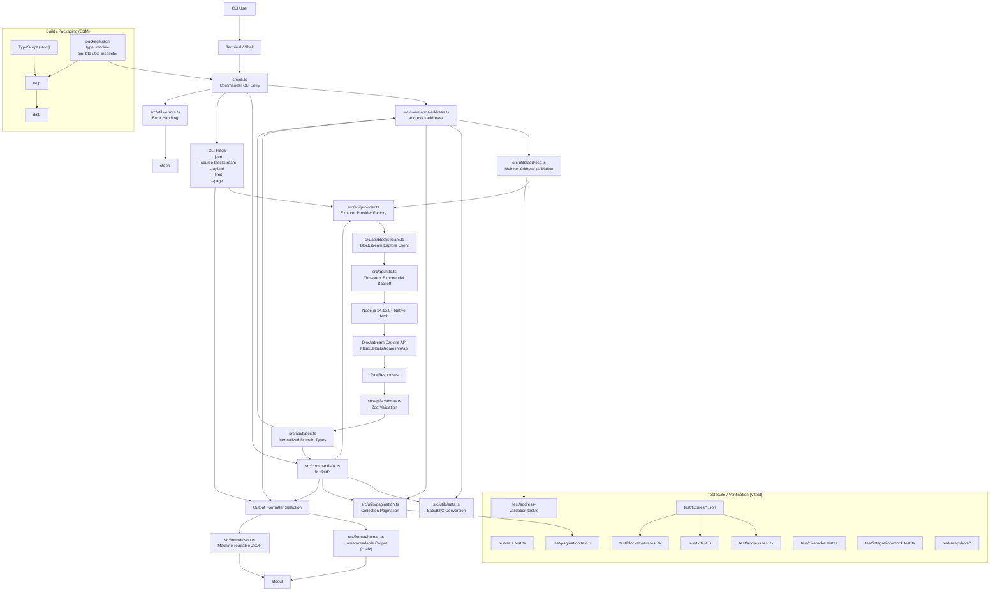

# BTC UTXO Inspector — Architecture

High-level data flow for the MVP CLI (`address`, `tx`), aligned with [PRD.md](./PRD.md) and [tasks.md](./tasks.md).

## MVP surface

| Layer | Responsibility |
|---|---|
| `src/cli.ts` | Subcommands, global flags, routes to formatters |
| `src/commands/*` | Orchestrate fetch → normalize → return result |
| `src/api/provider.ts` | Select provider client from `--source`; only `blockstream` is implemented for MVP |
| `src/api/http.ts` | Native fetch wrapper with timeout and exponential backoff |
| `src/api/blockstream.ts` | HTTP + zod validate + map to domain types |
| `src/format/*` | Human-readable or JSON output to stdout |
| `src/utils/*` | Address validation, pagination, sats/BTC helpers, stderr errors, exit codes |
